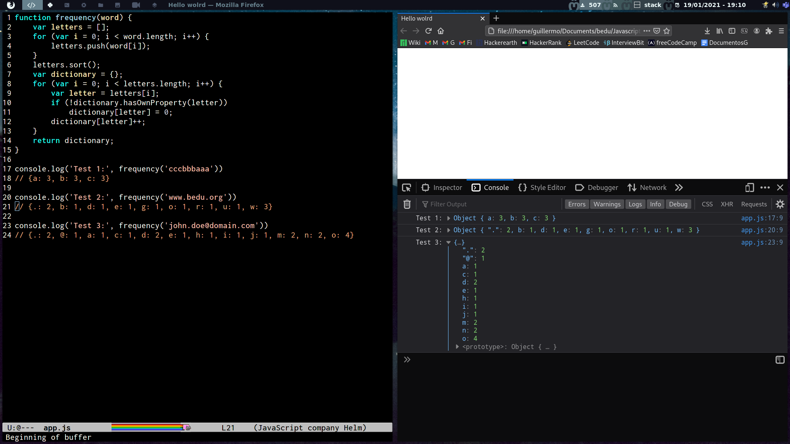

# Poswork1 Javascript fundamentals

## DeepEqual

## Chunk 

## [Frecuency](./frecuency/)
~~~
function frequency(word) {
    var letters = [];
    for (var i = 0; i < word.length; i++) {
        letters.push(word[i]);
    }
    letters.sort();
    var dictionary = {};
    for (var i = 0; i < letters.length; i++) {
        var letter = letters[i];
        if (!dictionary.hasOwnProperty(letter))
            dictionary[letter] = 0;
        dictionary[letter]++;
    }
    return dictionary;
}

console.log('Test 1:', frequency('cccbbbaaa'))
// {a: 3, b: 3, c: 3}

console.log('Test 2:', frequency('www.bedu.org'))
// {.: 2, b: 1, d: 1, e: 1, g: 1, o: 1, r: 1, u: 1, w: 3}

console.log('Test 3:', frequency('john.doe@domain.com'))
// {.: 2, @: 1, a: 1, c: 1, d: 2, e: 1, h: 1, i: 1, j: 1, m: 2, n: 2, o: 4}
~~~

