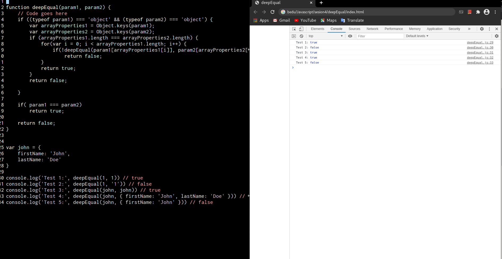
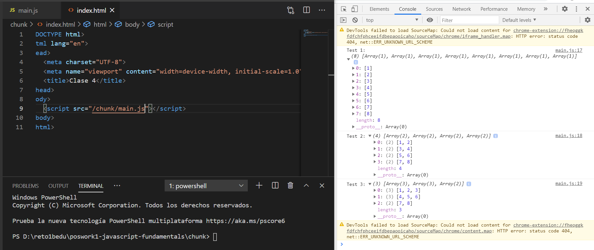

# Poswork1 Javascript fundamentals

## [DeepEqual](./deepEqual)
~~~
function deepEqual(param1, param2) {
    // Code goes here
    if ((typeof param1) === 'object' && (typeof param2) === 'object') {
        var arrayProperties1 = Object.keys(param1);
        var arrayProperties2 = Object.keys(param2);
        if (arrayProperties1.length === arrayProperties2.length) {
            for(var i = 0; i < arrayProperties1.length; i++) {
                if(!deepEqual(param1[arrayProperties1[i]], param2[arrayProperties2[i]]))
                    return false;
            }
            return true;
        }
        return false;

    }

    if( param1 === param2)
        return true;

    return false;
}

var john = {
    firstName: 'John',
    lastName: 'Doe'
}

console.log('Test 1:', deepEqual(1, 1)) // true
console.log('Test 2:', deepEqual(1, '1')) // false
console.log('Test 3:', deepEqual(john, john)) // true
console.log('Test 4:', deepEqual(john, { firstName: 'John', lastName: 'Doe' })) // true
console.log('Test 5:', deepEqual(john, { firstName: 'John' })) // false
~~~

## [Chunk](./chunk/) 
~~~
function chunk(array, size) {
    var output = [];
    for (var i = 0; i < array.length; i++) {
      var lastItem = output[output.length - 1];
      if (!lastItem || lastItem.length === size) {
        output.push([array[i]]);
      } else {
        lastItem.push(array[i]);
      }
    }
    return output;
}
  
  var data = [1, 2, 3, 4, 5, 6, 7, 8]
  
  console.log('Test 1:', chunk(data, 1)) // [[1], [2], [3], [4], [5], [6], [7], [8]]
  console.log('Test 2:', chunk(data, 2)) // [[1, 2], [3, 4], [5, 6], [7, 8]]
  console.log('Test 3:', chunk(data, 3)) // [[1, 2, 3], [4, 5, 6], [7, 8]]

~~~

## [Frecuency](./frecuency/)
~~~
function frequency(word) {
    var letters = [];
    for (var i = 0; i < word.length; i++) {
        letters.push(word[i]);
    }
    letters.sort();
    var dictionary = {};
    for (var i = 0; i < letters.length; i++) {
        var letter = letters[i];
        if (!dictionary.hasOwnProperty(letter))
            dictionary[letter] = 0;
        dictionary[letter]++;
    }
    return dictionary;
}

console.log('Test 1:', frequency('cccbbbaaa'))
// {a: 3, b: 3, c: 3}

console.log('Test 2:', frequency('www.bedu.org'))
// {.: 2, b: 1, d: 1, e: 1, g: 1, o: 1, r: 1, u: 1, w: 3}

console.log('Test 3:', frequency('john.doe@domain.com'))
// {.: 2, @: 1, a: 1, c: 1, d: 2, e: 1, h: 1, i: 1, j: 1, m: 2, n: 2, o: 4}
~~~

